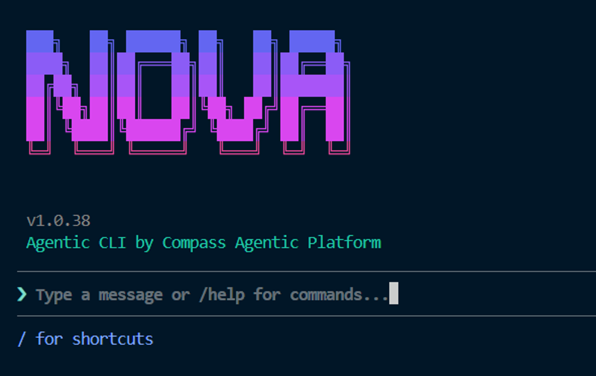
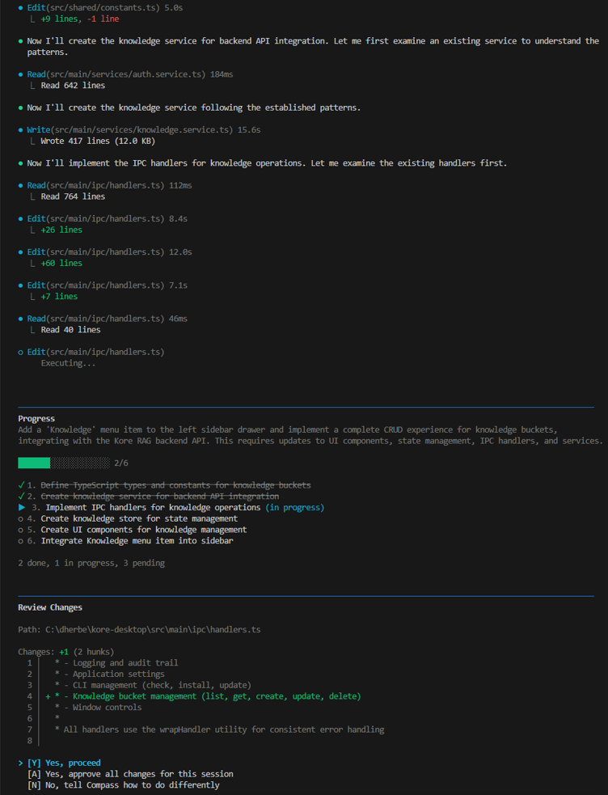
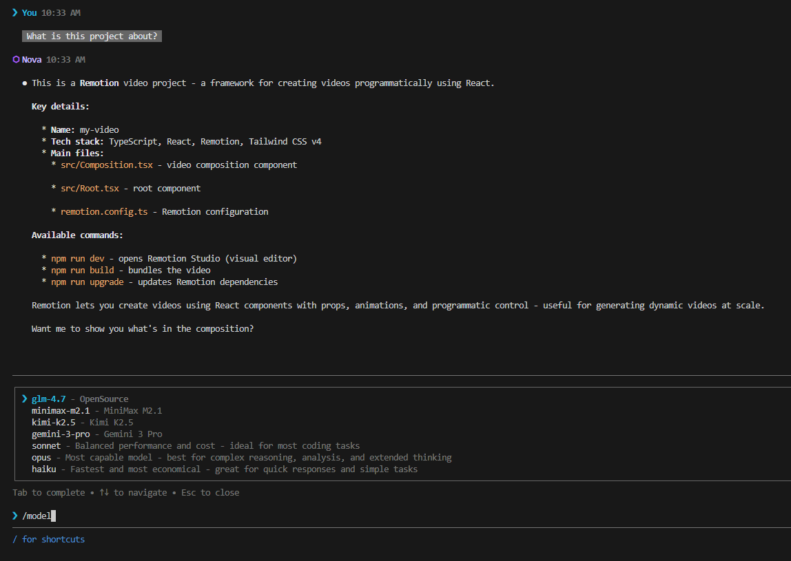

# Nova - AI-Powered Development Assistant

<div align="center">



**The terminal-first AI assistant that understands your codebase, respects your workflow, and keeps you in control.**

[](https://www.npmjs.com/package/@compass-ai/nova)
[](https://nodejs.org/)

</div>

---

## ⚡ Quick Start

```bash
npm install -g @compass-ai/nova
nova setup
nova
```

---

## 🌟 The All-In-One AI Development Platform

Nova is part of the **Compass Platform** ecosystem — a unified AI development solution:

| Platform Component | Description |
|-------------------|-------------|
| 🖥️ **Desktop App** | Full GUI experience with rich visualizations |
| 🌐 **Web Platform** | Access your projects from anywhere |
| 💻 **CLI (Nova)** | Terminal-first power user experience |
| 💻 **Excel Add-In** | Transform how your organization works with spreadsheets. |

**One subscription. Four ways to work. Complete flexibility.**

---

## 🚀 Why Nova?

Nova isn't just another AI coding tool. It's built from the ground up for developers who want **power without surrendering control**.

**Stay in flow:** No browser tabs, no copy-pasting, no context switching. Describe what you need in plain English and Nova handles the rest — reading files, writing code, running commands, and managing git — all from your terminal.

| Feature | Nova | Typical AI Assistants |
|---------|------|----------------------|
| **Multi-Platform** | CLI + Desktop + Web | CLI only |
| **LLM Flexibility** | Anthropic + Ollama + GLM | Vendor-locked |
| **Context Window** | 200K tokens | Limited |
| **Approval System** | 3-tier: Manual/Auto/Strict | All-or-nothing |
| **Codebase Indexing** | Automatic semantic search | None or basic |
| **Skills & Agents** | Full ecosystem support | Limited |
| **Session Management** | Save/load/export/compact | Ephemeral |
| **Cost Tracking** | Real-time token & cost stats | None |
| **Privacy** | Local-first, GDPR compliant | Cloud-dependent |

---

## ✨ Key Differentiators

### 🔐 Compass Platform Integration

Connect Nova to the Compass Platform with a single API key:

**Benefits:**
- 🔄 **Sync** sessions across Desktop, Web, and CLI
- 📊 **Unified** usage analytics and billing
- 🎯 **Centralized** agent and skill management
- 🛡️ **Enterprise** SSO and team management

**Learn more:** [Compass Agentic Platform](https://www.compassap.ai/)

### 🤖 Multi-Model Support

**Choose your model based on the task:**
- ⚡ **Speed** → Claude Haiku 4.5 or Ollama for quick iterations
- 💪 **Power** → Claude Sonnet 4.5 for balanced performance
- 🧠 **Reasoning** → Claude Opus 4.5 for complex analysis
- 🔧 **Alternatives** → GLM 4.7, Minimax, Kimi, Gemini

Switch models mid-session with `/model` — no restart required.

### 🛠️ Skills & Agents Ecosystem

Nova is fully compatible with the Compass agent ecosystem:

#### Skills System

Reusable, composable AI capabilities:
```
skills/
├── code-review/
│   ├── description: "Comprehensive code review"
│   └── actions: [analyze, suggest, report]
├── refactor/
│   ├── description: "Safe code refactoring"
│   └── actions: [identify, plan, execute]
└── test-gen/
    ├── description: "Generate unit tests"
    └── actions: [scan, generate, validate]
```

> **Note:** For information about the Agent Skills standard, see [agentskills.io](https://agentskills.io).


#### Agents Configuration (agents.md)
Define specialized agents for different tasks:

```markdown
---
name: security-audit
description: "Security-focused code analysis agent"
model: sonnet-4-20250514
approval-mode: strict
allowed-tools:
  - FileTools(Read)
  - Bash(git:*)
---

Focus on: OWASP Top 10, dependency vulnerabilities, secret detection
```

#### Subagents System
Spawn specialized agents for complex tasks:

```
❯ /agent security-audit
→ Spawns security-focused subagent with strict approval mode

❯ /agent refactor-expert
→ Spawns refactoring specialist with auto-save checkpoints
```

**Check out:** [Awesome Skills & Agents Repository](https://github.com/dherbe-digital/nova-skills-collection)

### 🔒 Safety First with Three-Tier Approval

```
┌─────────────────────────────────────────────────────────┐
│  Manual Mode (Default)                                  │
│  → Review every change before it's applied              │
│                                                         │
│  Auto Mode                                              │
│  → Safe operations auto-approved, risky ones reviewed   │
│                                                         │
│  Strict Mode                                            │
│  → Maximum safety, all ops require explicit approval    │
│                                                         │
│  🔐 Compass Platform users get additional:              │
│  → Team approval workflows                              │
│  → Audit logs for compliance                            │
└─────────────────────────────────────────────────────────┘
```

**Built-in safeguards:**
- Automatic file backups before every modification
- `/undo` command to rollback changes instantly
- External modification detection prevents overwrites
- Token usage limits to control costs

### 🧠 Deep Codebase Understanding

Nova automatically indexes your project with a **200K token context window** and understands:
- File relationships and dependencies
- Function calls and imports
- Project structure and architecture
- Semantic code patterns for intelligent search

```
❯ nova: "Find all files that handle user authentication"

→ auth.service.ts (primary)
→ jwt-utils.ts (utility)
→ middleware/auth.ts (middleware)
→ tests/auth.spec.ts (tests)
```

### 💬 Natural Conversations

Describe what you want in plain English. Nova handles the implementation with 20+ built-in tools for file operations, shell commands, and git integration.

```
❯ "Refactor the authentication module to use JWT tokens"

→ Analyzes current implementation
→ Creates secure JWT-based auth
→ Updates all dependent files
→ Preserves backward compatibility
```

Your conversation history persists with auto-save, and you can export sessions as Markdown, JSON, or HTML for documentation.

---

## ⌨️ Slash Commands

Stay in flow with quick commands:

| Command | Description |
|---------|-------------|
| `/model` | Switch models on-the-fly (Opus, Sonnet, Haiku) |
| `/commit` | Generate conventional commits from staged changes |
| `/approve` | Toggle between Manual, Auto, and Strict modes |
| `/undo` | Rollback the last file modification |
| `/compact` | Summarize conversation to free up context |
| `/export` | Save conversation as Markdown, JSON, or HTML |
| `/tokens` | View current session token usage |
| `/cost` | Display estimated API costs |
| `/index` | Reindex project for semantic search |
| `/agents` | Switch to specialized agents |

---

## 🎯 Use Cases

### Code Refactoring
```
❯ "Convert this callback-based code to async/await"
```

### Debugging
```
❯ "I'm getting a null pointer error in checkout.ts line 45"
```

### Security Auditing
```
❯ /agent security-audit
→ Spawns specialized security agent
```

### Code Understanding
```
❯ "Explain how the payment processing flow works"
```

### Documentation
```
❯ "Generate JSDoc comments for all functions in src/utils/"
```

### Git Operations
```
❯ "Create a commit with a descriptive message for my changes"
```

### Testing
```
❯ "Write unit tests for the payment processing module"
```

### Custom Agent Workflows
```
❯ /agent code-review --strict
→ Specialized agent with custom configuration
```

---

## 📸 Screenshots

<div align="center">



*Natural language interactions in your terminal*

---



*Switch between Anthropic and Ollama seamlessly*

---

</div>

---

## 🏆 Why Developers Choose Nova

> "Nova's integration with the Compass Platform is seamless. I switch between CLI and Desktop depending on my task, and everything syncs perfectly."
> — Full-Stack Developer

> "The ability to use Ollama for quick tasks and Anthropic for complex reasoning gives me the perfect balance of speed and power."
> — Senior Engineer at ScaleUp

> "The skills ecosystem is a game-changer. I built custom agents for our team's specific workflows."
> — Tech Lead at Enterprise

> "Finally, an AI tool that respects my privacy with local Ollama support while giving me access to top-tier models when needed."
> — Security-Conscious Developer

---


## 🔗 Links

- [npm Package](https://www.npmjs.com/package/@compass-ai/nova)
- [Compass Platform](https://compassap.ai/)
- [Report Issues](https://github.com/Compass-Agentic-Platform/nova/issues)

---

<div align="center">

**Ready to supercharge your development workflow?**

[Get Compass Platform](https://compassap.ai/) → [Install Nova](https://www.npmjs.com/package/@compass-ai/nova)

</div>

---

*Nova - Built for developers, by developers. Part of the Compass Platform ecosystem.*

Date: 2026-01-29

---

Co-authored by [Nova](https://www.compassap.ai/portfolio/nova.html)